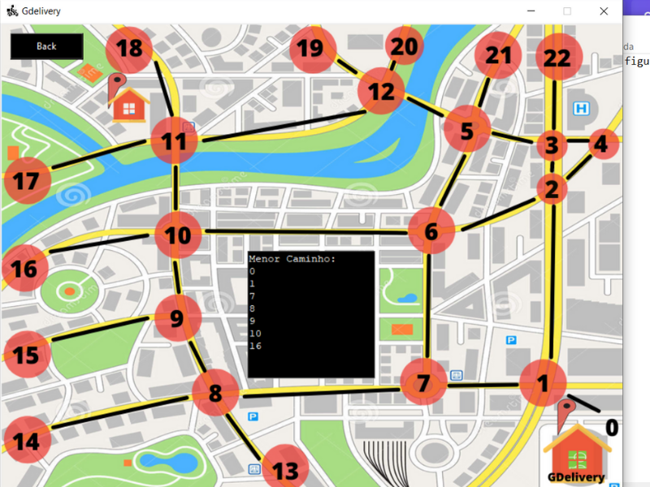

# GDelivery

**Número da Lista**: X<br>
**Conteúdo da Disciplina**: Grafos 1<br>

## Alunos
|Matrícula | Aluno |
| -- | -- |
| 18/0100831  |  Gabriel Avelino |
| 18/0103431  |  João Victor Valadão |

## Sobre 
O nosso projeto é chamado de GDelivery, onde o objetivo é achar o melhor e mais curto caminho para sua entrega, usando grafos BFS para encontrar esse caminho. Com a utilização de interfaces gráficas feitas no TKinter uma biblioteca padrão python para a fácil visualização desses caminhos.

## Apresentação

<<<<<<< HEAD
Segue o link para a apresentação dessa segunda entrega:

[](https://youtu.be/V98-hE-wLLE)

## Screenshots

<center>


<center>
<figcaption>Figura 1: Tela inicial do aplicativo</figcaption>
</center>


<center>
<figcaption>Figura 2: Tela visualizar mapa</figcaption>
</center>


<center>
<figcaption>Figura 3: Tela do caminho</figcaption>
</center>

</center>

## Instalação 
**Linguagem**: Python<br>
**Framework**: TKinter (biblioteca padrão do python)<br>

Para o funcionamento do projeto é necessário rodar:

```jsx
pip install pillow
```

## Uso 
Para rodar o aplicativo é bem simples, rode o programa utilizando o **main.py** com o seguinte comando abaixo:

```jsx
python main.py
ou
python3 main.py
```


